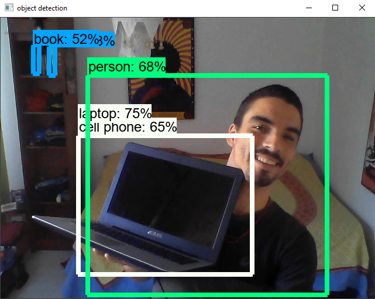

## webcam-detection

Live detecion from webcam, based on tensorflow object detection api.

Follow the official [tensorflow object detection api tutorial](https://tensorflow-object-detection-api-tutorial.readthedocs.io/en/latest/install.html) to install the required packages.

After installing all the packages, run

```
python livedetection.py
```




### References to install the packages on windows

- Visual Studio Builders tool : https://visualstudio.microsoft.com/visual-cpp-build-tools/
- Protoc : https://github.com/protocolbuffers/protobuf/blob/master/src/README.md#c-installation---windows
- Protoc : https://medium.com/@dev.ashurai/protoc-protobuf-installation-on-windows-linux-mac-d70d5380489d
- Issues when installing : https://github.com/cocodataset/cocoapi/issues/169